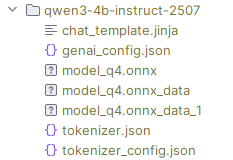
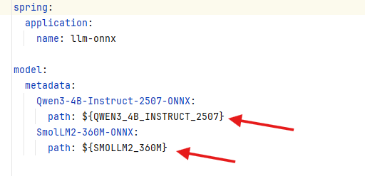

# LLM ONNX inference spring boot application

----

### Как запустить

Клонировать проект

Скачать файлы модели из репозитория и разместить их в плоской структуре

[Qwen3-4B-Instruct-2507-ONNX](https://huggingface.co/onnx-community/Qwen3-4B-Instruct-2507-ONNX/tree/main)



Добавив туда [genai_config.json](docs/qwen3_genai_config.json) (переименовать образец)

[SmolLM2-360M-ONNX](https://huggingface.co/onnx-community/SmolLM2-360M-ONNX/tree/main)


Добавив туда [genai_config.json](docs/smollm2_genai_config.json) (переименовать образец)

Указать пути в `src/main/resources/application.yml` или прокинуть через переменные окружения



Собрать и запустить JAR-файл

```
cd llmonnx
./gradlew clean build
java -jar build/libs/llmonnx-0.0.1-SNAPSHOT.jar
```

----

### Сделать запрос

API является open AI-совместимым

#### Non-streaming

```
POST http://localhost:8080/api/v1/chat/completions

Headers:
Accept: application/json

Body:
{
  "model": "SmolLM2-360M-ONNX",
  "messages": [
    {
      "role": "user",
      "content": "What color does the sun have?"
    }
  ],
    "temperature": 0.3,
    "top_p": 0.9,
    "repetition_penalty": 1.2,
    "max_tokens": 16
}
```

#### Streaming

```
POST http://localhost:8080/api/v1/chat/completions

Headers:
Accept: text/event-stream

Body:
{
  "model": "SmolLM2-360M-ONNX",
  "messages": [
    {
      "role": "user",
      "content": "What color does the sun have?"
    }
  ],
    "stream": true,
    "temperature": 0.3,
    "top_p": 0.9,
    "repetition_penalty": 1.2,
    "max_tokens": 16
}
```